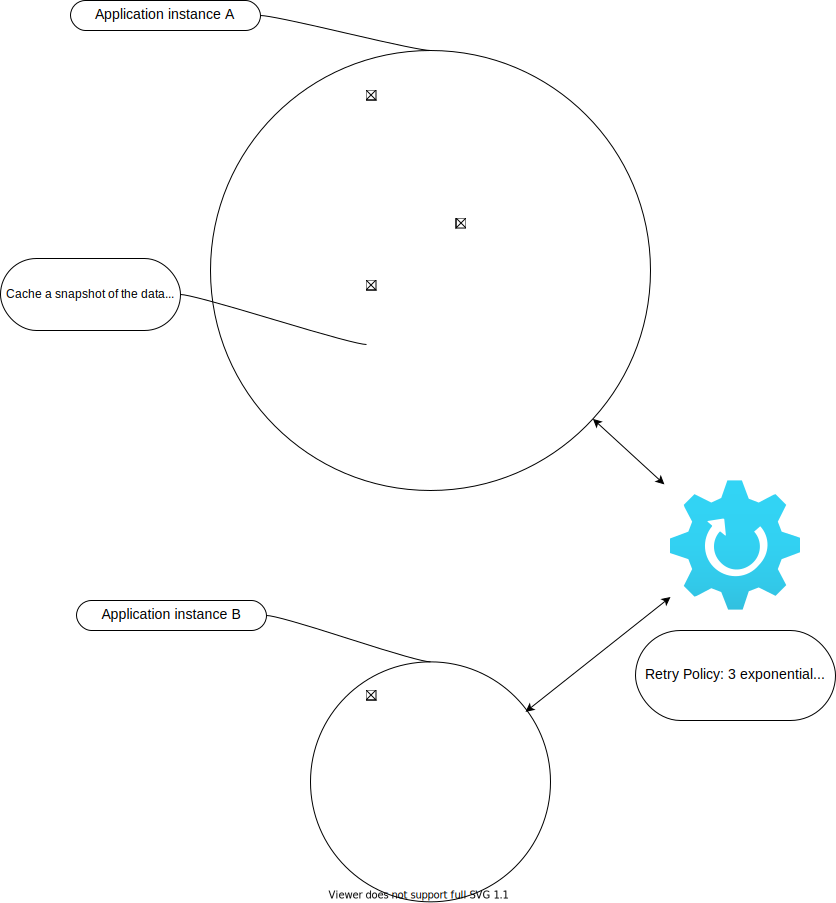

# Propuesta de la solucion para hackaton ceiba 2021
## Descripcion de la solucion 
This is a .NET Core 2 sample project showing how to implement a custom reverse proxy, as described in the article [Building a Reverse Proxy in .NET Core](https://auth0.com/blog/building-a-reverse-proxy-in-dot-net-core/).

## Drivers de la aplicación

You can run the Web application from Visual Studio or by typing `dotnet run` in a command window.

When the application is running, you can point your browser to `localhost:5001` and access a Google form without leaving the `localhost` domain.

# Diagrama de la solución.

